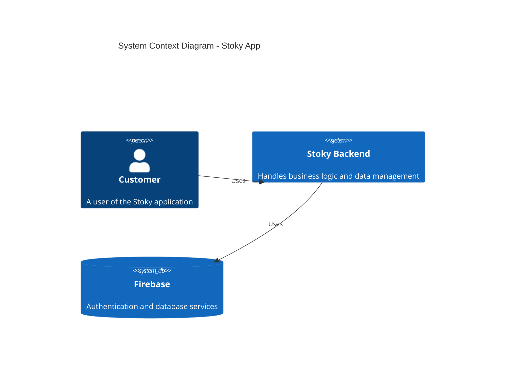
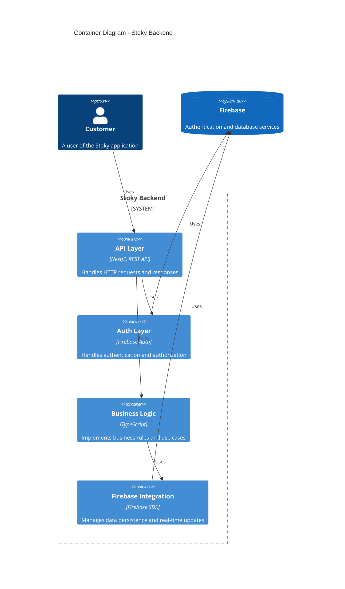
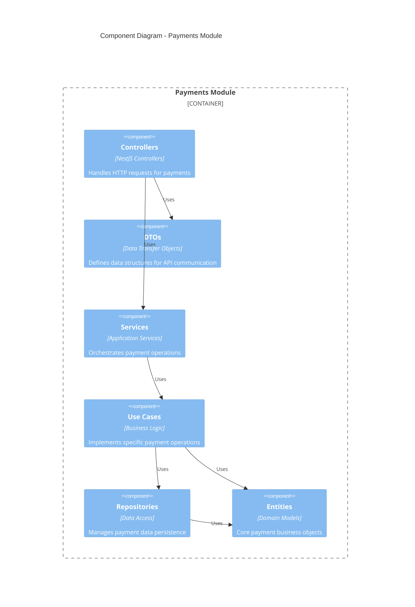
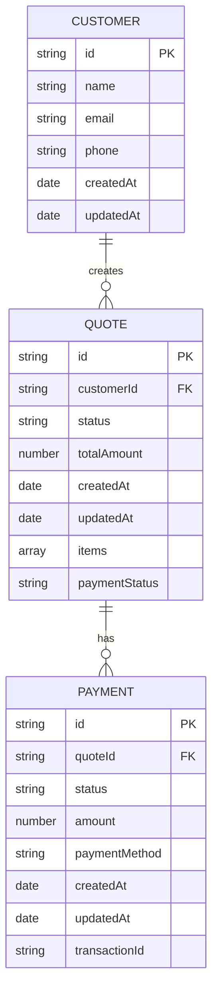
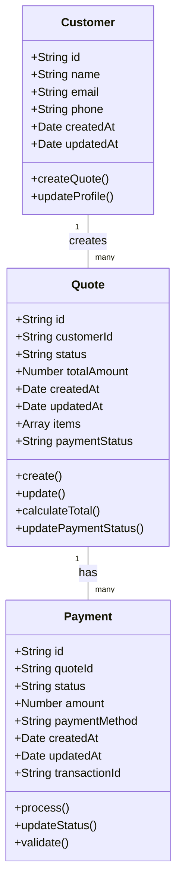
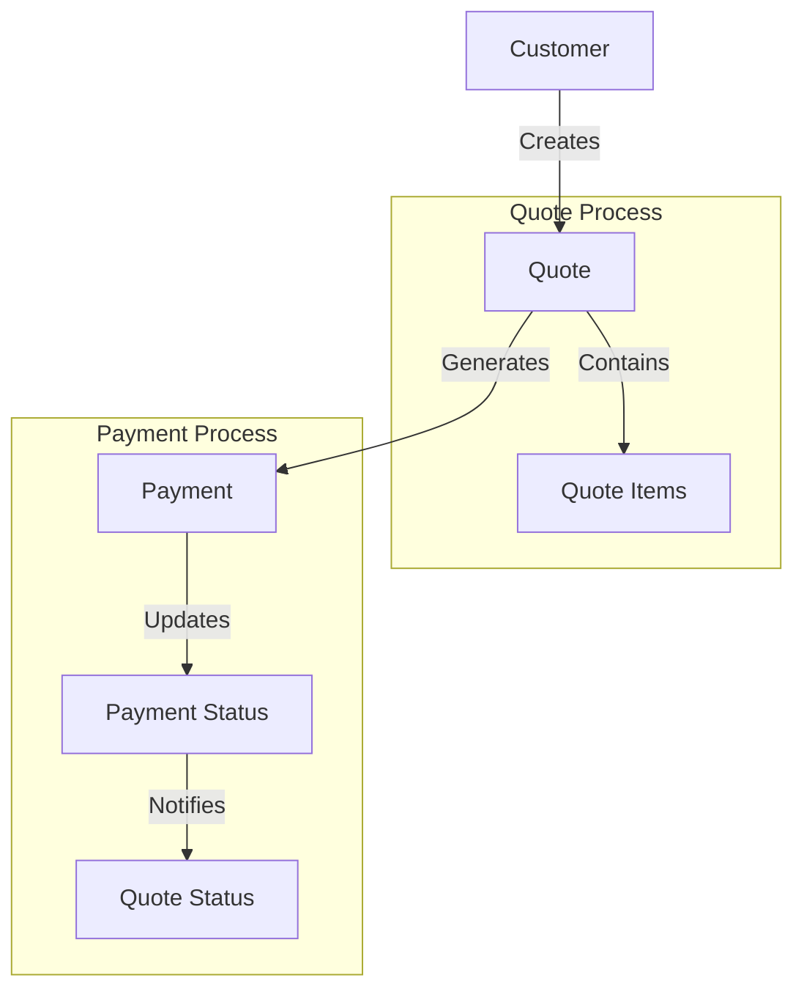

# Stoky App Backend

A NestJS backend application built with Clean Architecture principles, providing APIs for payment and quote management.

## Table of Contents

- [Installation](#installation)
- [Project Structure](#project-structure)
- [Clean Architecture](#clean-architecture)
- [System Architecture](#system-architecture)
- [Data Model](#data-model)
- [Running the Application](#running-the-application)
- [Testing](#testing)

## Installation

### Prerequisites

- Node.js (v18 or higher)
- Yarn package manager
- Firebase account (for authentication and database)

### Setup

1. Clone the repository:
   ```bash
   git clone https://github.com/yourusername/stoky-app-back.git
   cd stoky-app-back
   ```

2. Install dependencies:
   ```bash
   yarn install
   ```

3. Set up environment variables:
   Create a `.env` file in the root directory with the following variables:
   ```
   PORT=8000
   FIREBASE_DB_URL=your-firebase-database-url
   ```

4. Configure Firebase:
   - Place your Firebase service account key in `src/shared/config/firebase/serviceAccountKey.json`

## Project Structure

The project follows a modular structure based on Clean Architecture principles:

```
src/
├── main.ts                  # Application entry point
├── app.module.ts            # Root application module
├── payments/                # Payments module
│   ├── domain/              # Domain layer
│   │   ├── entities/        # Business entities
│   │   └── repositories/    # Repository interfaces
│   ├── application/         # Application layer
│   │   ├── services/        # Application services
│   │   └── use-cases/       # Use cases
│   ├── infrastructure/      # Infrastructure layer
│   │   └── repositories/    # Repository implementations
│   └── interface/           # Interface layer
│       ├── controllers/     # API controllers
│       ├── dtos/            # Data Transfer Objects
│       └── mappers/         # Entity-DTO mappers
├── quotes/                  # Quotes module (similar structure)
├── shared/                  # Shared resources
│   ├── config/              # Configuration
│   └── guards/              # Authentication guards
└── utils/                   # Utility functions
```

## Clean Architecture

This project implements Clean Architecture, a software design philosophy introduced by Robert C. Martin. The architecture is divided into layers:

### Benefits of Clean Architecture

1. **Independence of Frameworks**: The core business logic is independent of external frameworks, making it easier to replace or upgrade them.

2. **Testability**: Each layer can be tested independently, with clear boundaries between components.

3. **Independence of UI**: The user interface can be changed without affecting the business logic.

4. **Independence of Database**: The database can be changed without affecting the business logic.

5. **Independence of External Agencies**: The business rules don't depend on external agencies.

### Layers

1. **Domain Layer**: Contains enterprise business rules and entities.
   - Entities: Core business objects (Payment, Quote)
   - Repository Interfaces: Define how data is accessed

2. **Application Layer**: Contains application business rules.
   - Use Cases: Implement specific business operations
   - Services: Orchestrate use cases and handle application logic

3. **Infrastructure Layer**: Contains frameworks, tools, and external interfaces.
   - Repository Implementations: Concrete implementations of repositories
   - External Services: Firebase, etc.

4. **Interface Layer**: Contains controllers, presenters, and gateways.
   - Controllers: Handle HTTP requests
   - DTOs: Data transfer objects for API communication
   - Mappers: Transform between entities and DTOs

## System Architecture

### C4 Model Diagrams

#### Level 1: System Context Diagram



#### Level 2: Container Diagram



#### Level 3: Component Diagram (Payments Module)



## Data Model

### Entity Relationship Diagram



### Domain Model



### Data Flow Diagram



## Running the Application

### Development Mode

```bash
yarn start:dev
```

The application will be available at `http://localhost:8000`.

### Production Mode

```bash
yarn build
yarn start:prod
```

## Testing

### Unit Tests

```bash
yarn test
```

### E2E Tests

```bash
yarn test:e2e
```

### Test Coverage

```bash
yarn test:cov
```

## API Endpoints

### Payments

- `POST /payments` - Create a new payment
- `GET /payments/quote/:quoteId` - Get payments by quote ID
- `GET /payments` - Get all payments
- `GET /payments/filters` - Get payments with filters
- `PATCH /payments/:id/status` - Update payment status

### Quotes

- `POST /quotes` - Create a new quote
- `GET /quotes/:id` - Get quote by ID
- `GET /quotes` - Get all quotes
- `GET /quotes/filters` - Get quotes with filters
- `PATCH /quotes/:id/payment-status` - Update quote payment status

## Author

**Johan Bustos**
- GitHub: [@JohanBustos](https://github.com/JohanBustos)
- Email: johan.bustosm@gmail.com